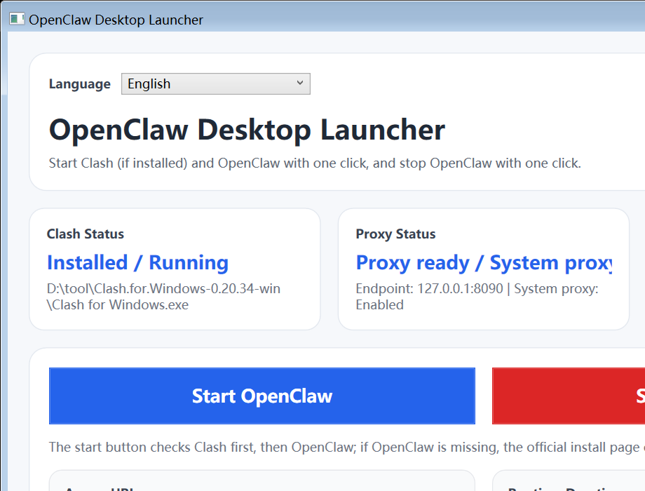

# OpenClaw Desktop Launcher


A multilingual Windows desktop launcher for OpenClaw that simplifies Clash startup, system proxy automation, local access opening, and runtime tracking into a clean one-click workflow.

[](https://github.com/jiwannian/openclaw-desktop-launcher/releases/latest)

## Screenshot



## Why this project

OpenClaw often works best when the surrounding desktop steps are also handled well: detecting Clash, making sure the proxy is available, enabling the Windows system proxy when needed, launching the gateway, opening the local access URL, and shutting everything down cleanly.

This launcher packages that workflow into a Windows desktop app so non-terminal users can use OpenClaw more comfortably.

## Features

- One-click start for OpenClaw
- One-click stop for OpenClaw
- Automatic Clash detection and optional startup
- Automatic Windows system proxy enablement after the proxy endpoint is ready
- Automatic opening of the local OpenClaw access URL after startup
- Runtime timer and status tracking
- Official OpenClaw installation page fallback when OpenClaw is not detected
- Portable Windows distribution through a single executable
- Built-in language switch in the top-left corner

## Supported Languages

The launcher currently includes these UI languages:

- English (default)
- Chinese
- Hindi
- Spanish
- Arabic
- Russian
- Portuguese
- French
- Italian
- Japanese

## Workflow

1. Detect whether Clash is installed and already running
2. Start Clash automatically if it is installed but not running
3. Wait for the proxy endpoint, default `127.0.0.1:8090`
4. Enable the Windows system proxy when configured
5. Detect whether OpenClaw is installed
6. Open the official install page if OpenClaw is missing
7. Start the OpenClaw gateway, default `http://127.0.0.1:18789/`
8. Open the local access URL automatically when the gateway is ready
9. Track runtime duration until shutdown
10. Stop OpenClaw through daemon stop and process cleanup fallback

## Quick Start

### Download

- Open the latest release page: `https://github.com/jiwannian/openclaw-desktop-launcher/releases/latest`
- Download `OpenClawDesktopLauncher-v1.1.0-win-x64.exe`
- Run the executable directly on Windows

### Build locally

Requirements:

- Windows 10 or Windows 11
- .NET 8 SDK

Build:

```powershell
dotnet build .\StartOpenClawLauncher\StartOpenClawLauncher.csproj
```

Run:

```powershell
dotnet run --project .\StartOpenClawLauncher\StartOpenClawLauncher.csproj
```

Publish a single-file executable:

```powershell
dotnet publish .\StartOpenClawLauncher\StartOpenClawLauncher.csproj -c Release -r win-x64 --self-contained true -p:PublishSingleFile=true
```

## Default Configuration

The app creates `config.json` next to the executable. Default values include:

- Proxy host: `127.0.0.1`
- Proxy port: `8090`
- Gateway host: `127.0.0.1`
- Gateway port: `18789`
- Startup timeout: `25` seconds
- Default language: `en`
- Auto-enable system proxy: enabled
- Auto-open local access URL after startup: enabled

You can customize detection lists through:

- `OpenClawCandidates`
- `ClashCandidates`
- `ClashProcessKeywords`

## Tech Stack

- C#
- WPF
- .NET 8
- Windows Registry integration for system proxy control

## Notes

- Windows only
- Clash auto-detection depends on local install paths, process names, or uninstall registry entries
- Custom OpenClaw or proxy setups may require editing `config.json`

## Disclaimer

This is an independent desktop launcher and is not affiliated with the official OpenClaw or Clash teams. Use it responsibly and in compliance with local laws, policies, and software terms.

